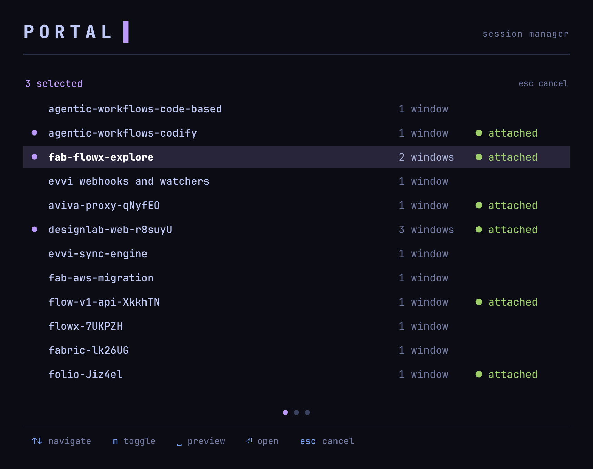
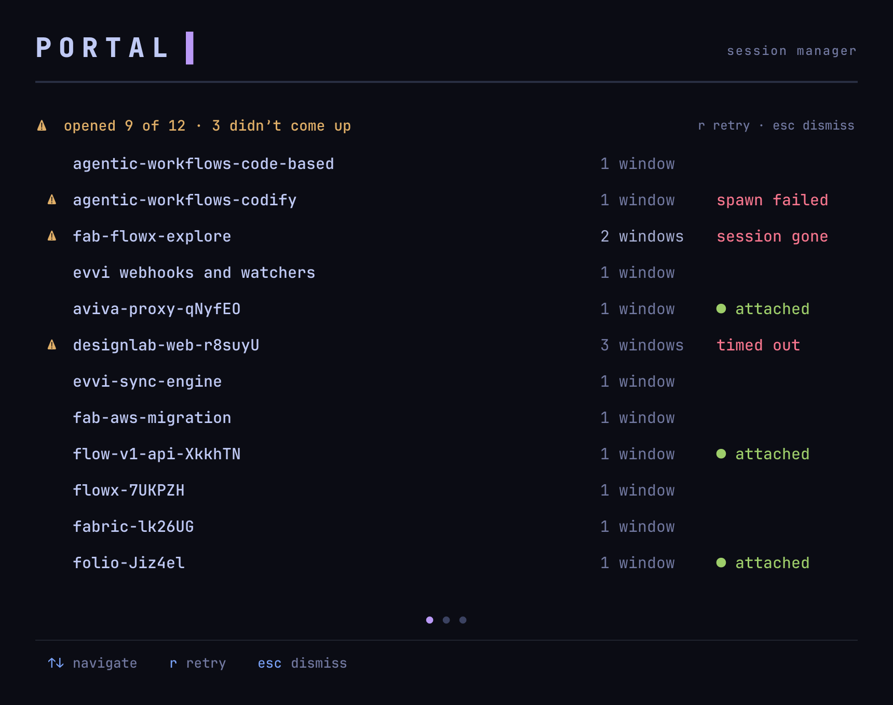
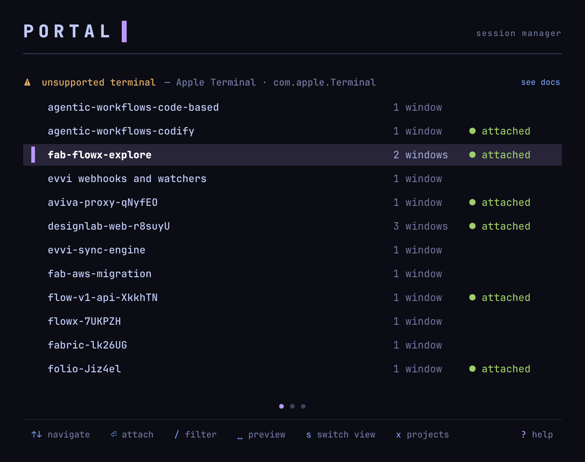

# Discussion: Restore Host Terminal Windows

## Context

Portal's resurrection layer restores the **tmux/server layer** after reboot (sessions/windows/panes rebuild on attach), but not the **host-local terminal layer** — the actual terminal-emulator windows that fronted those sessions. After a crash with ~32 sessions, ~28 reattached at the server level, but the user still rebuilt every macOS terminal window by hand (~14 Spaces, one project zone per Space) — roughly an hour of manual work.

This feature lets the user spawn N sessions, each springing into its own host terminal surface, via a **multi-select** in the Portal picker. Research closed the feasibility questions and locked a set of foundational decisions; this discussion resolves the **live design and operational decisions** that remain.

### Foundation already settled in research (not re-litigated here unless spawned)

- **Core shape:** a Sessions-page **multi-select mode** (proposed `M`) → select sessions → `Enter` → each springs open in its own host window, attached. Implemented as a *general selection mode* with spawn as its first action (future bulk ops can reuse it).
- **Windows-only:** window-vs-tab fidelity dropped → removes the entire introspection requirement.
- **Spawn command:** the N−1 new windows each run **`portal attach <session>`** (existing chokepoint connector); the **trigger window is reused** as one session via `switch-client`. Net window count = **N, not N+1** (no leftover empty picker window — a hard anti-requirement).
- **Cross-terminal:** Ghostty-first; **dual configurability** (built-in Go adapters + user-config override/escape hatch), both shipped in this feature. Precedence: **config override → native adapter → unsupported**.
- **Identity (feasibility-validated live):** detect the host terminal via **client-PID → process-tree walk → macOS bundle id**, matched as a **family** (e.g. `dev.warp.Warp-*`), with a **friendly alias** (`ghostty`) as the user-facing key. Client resolved by **highest `client_activity`** (`focused` is unreliable). Remote/mosh clients → NULL bundle id → honest no-op.
- **Unsupported-terminal UX:** info **banner** (not modal) naming the detected identity.
- **Duplicate-surface guard:** none — opening an already-attached session is a fine no-op (tmux synchronises both).
- **Scope yardstick:** this feature is "collapse the attaching into one action per batch" — a **partial win** the user explicitly accepts. Remember-the-grouping + macOS Spaces placement are deliberately separate future features (Spaces already parked in inbox).

### References

- Research: [restore-host-terminal-windows.md](../research/restore-host-terminal-windows.md)
- Deep-dives (cache): terminal-automation-surface (001), identity-detection (002/003)

## Discussion Map

A living index of subtopics tracked during the discussion. Grows as the conversation branches, converges as decisions land.

### States

- **pending** (`○`) — identified but not yet explored
- **exploring** (`◐`) — actively being discussed
- **converging** (`→`) — narrowing toward a decision
- **decided** (`✓`) — decision reached with rationale documented

### Map

  Discussion Map — Restore Host Terminal Windows (13 subtopics — 13 decided)

  ┌─ ✓ 1. Spawn-execution architecture — where the spawn runs from [F6] [decided]
  ├─ ✓ 2. Multi-select trigger & keymap coexistence [F7] [decided]
  ├─ ✓ 3. Burst & partial-failure contract [F1] [decided]
  ├─ ✓ 4. Trigger-context matrix (in/out tmux × attached × includes-self) [F2] [decided]
  ├─ ✓ 5. TCC first-run Automation-permission flow [F4] [decided]
  ├─ ✓ 6. Config schema & command representation [F9] [decided]
  ├─ ✓ 7. Terminal-identity UX — what we display & accept as config key [rv2-UX] [decided]
  ├─ ✓ 8. Adapter contract shape & extensibility (capability-based) [fwd-looking] [decided]
  ├─ ✓ 9. Testing strategy & DI seam [F5] [decided]
  ├─ ✓ 10. Daemon / state footprint (windows-only) [F10] [decided]
  ├─ ✓ 11. Attach contention vs post-reboot hydration [F12] [decided]
  ├─ ✓ 12. Pre-build validation flags (validated live) [rv2-F4/F5] [decided]
  └─ ✓ 13. Design in Paper — page + interactions (3 frames delivered + approved) [decided]

---

*Subtopics are documented below as they reach `decided` or accumulate enough exploration to capture.*

---

## 1. Spawn-Execution Architecture

### Context

Research (review-F6) framed this as "where spawn executes architecturally": picker action shelling out from the TUI process vs a new `portal` subcommand vs both — flagged as coupled to identity detection because it determines which process's env feeds detect-self, how the attach line is assembled, and whether a headless/scriptable spawn is possible. It's the keystone: settling it shapes the config schema, test seam, and daemon footprint.

### The constraint that narrows the space

The decision is tighter than F6 implies. The **no-leftover-window** anti-requirement (net N windows, never N+1) forces the picker to **own its own window reuse**: it turns its own host window into one session via `switch-client` (inside tmux) or exec-`tmux attach` (outside tmux), which *replaces the picker process* so the window becomes a session rather than falling back to an empty shell. Therefore the picker always self-attaches to one of the N; only the **N−1 others** are externally spawned, and each just runs the **existing `portal attach <session>`**. So "where spawn runs" reduces to: *where does the detect-terminal + spawn-the-N−1 logic live?*

### Options Considered

**Option A — inline in the TUI.** The Bubble Tea process, on `Enter`, detects the host terminal and fires the spawns itself, then self-attaches.
- Cons: spawn logic buried in the update loop is hard to unit-test; capability locked inside the TUI (no CLI reuse for tests / `--detect` / the future workspace feature); no clean DI seam.

**Option B — shared internal package + `portal spawn` subcommand (chosen).** Detection + adapter resolution + spawn live in an internal package; `portal spawn <sessions…>` is a thin CLI over it; the picker calls the **same package in-process** for the N−1, then self-attaches.
- Pros: argv→effects boundary is unit-testable with a faked `Adapter` (command construction, detect-self resolution, precedence); `portal spawn` is a first-class CLI seam — a `--detect` dry-run and the entry point the deferred "remember-and-restore workspace" + Spaces follow-ons reuse (always from a terminal context, not truly headless — see #7/F2); matches the project's DI pattern.
- Cons: slightly more surface than A (a new subcommand + package).

### Journey

Started from F6's three-way framing (picker vs subcommand vs both). Realised the "both" tension mostly dissolves once you see the picker *must* keep ownership of its own window reuse (the anti-leftover rule), so the subcommand can never own the whole flow — it owns the N−1 spawns, the picker owns its self-attach. That reframes A-vs-B as purely "where does the reusable spawn logic live," which testability + the explicitly-deferred workspace-restore feature settle decisively for B.

Considered detection placement as a complication (does the subcommand vs TUI change what env detect-self sees?) and concluded it doesn't fight the choice: detection's backbone is the process-tree walk (`list-clients` → client PID by highest `client_activity` → walk to terminal bundle id), a library call both callers can make; env vars are only an optional fast-path. Detection anchors on the **triggering picker process** — outside tmux it walks its *own* tree to the terminal; inside tmux it hops via `list-clients` to the host client and walks that (one extra hop, same destination). Full identity resolution is subtopic #7.

Walked the concrete 3-session flow to confirm the model: (1) detect terminal → (2) one `osascript` call per N−1 window, each carrying `portal attach <session>` as its startup command → (3) exec self into the last session. **Order is load-bearing**: step 3 is a point of no return (exec replaces the picker), so the N−1 spawns must complete first. One spawn call per window (not one combined script) for failure isolation.

In-process vs subprocess for the picker→spawn call: chose **in-process** so spawn errors surface back into the TUI where the user is looking; the `portal spawn` subprocess remains the CLI front door (tests / `--detect` / future feature). Both the "in-process vs subprocess" detail and "does the picker wait to confirm the N−1 spawned before it execs into the Nth?" are **coupled to #3** (partial-failure contract) — left open there.

### Decision

**Option B.** Build a shared internal spawn package (detection + adapter resolution + spawn), exposed two ways: called **in-process by the picker** for the N−1 spawns, and as a **`portal spawn <sessions…>` subcommand** — the CLI seam for tests, a `--detect` dry-run, and the future-feature entry point (always from a terminal context, never truly headless; see #7/F2). Each spawned window runs the existing `portal attach <session>`; `portal spawn` is *not* what runs in the new windows. The picker self-attaches to the remaining session via its existing connector, reusing its own window (anti-leftover). Confidence: high.

- **Mental model:** one service, two callers — like a Laravel Service class reached from both an Artisan command and an HTTP controller.
- **Coupled-out:** in-process-vs-subprocess + wait-for-spawn-confirmation → #3; full terminal-identity detection → #7.
- **Impl flag (review-002 F3, for spec):** spawned windows run `portal attach` as their startup command, so `portal`/`tmux` must be on `PATH` in Ghostty's launch context (not guaranteed a login shell).
- **Bootstrap cost → external dependency (review-001 F1).** `attach` is not in `skipTmuxCheck`, so each spawned `portal attach` re-runs the full 11-step bootstrap orchestrator — a 14-window burst would fire 13 near-simultaneous full bootstraps against one server (a distinct concern from #11's tmux-attach race). We rejected the two workarounds (a hidden `--skip-bootstrap` flag; an internal bootstrap-exempt `portal state attach`-style command) — the latch belongs in bootstrap, not in a parallel attach path, and the awkward command name was the tell. Resolved by a **separate `warm-command-bootstrap-latch` feature** (logged to inbox `2026-06-30--warm-command-bootstrap-latch`): a once-per-server-lifetime tmux server-option latch (`@portal-bootstrapped`) set at end of bootstrap, so warm commands fast-skip the 11 steps. **This feature depends on that landing first**; spawn then spawns *plain* `portal attach` with no special-casing. This largely **subsumes #11** (attach contention).
- **Spawn via the picker's own executable path (review-001 F3).** The N−1 windows spawn running `<os.Executable()> attach <session>`, **not** a bare `portal` PATH lookup. The warm-command latch is *version-gated* — satisfied only if stored version == running version (verified against the skip-bootstrap code: `state.BootstrappedLatchSatisfied`) — so a PATH-resolved spawn of a *different* portal version would read the latch unsatisfied and full-bootstrap per window, resurrecting the burst storm. The picker's own binary guarantees version parity → latch satisfied → burst stays abridged. Side-effect: `portal` no longer needs to be *on* PATH (only `tmux` does, since portal shells to it), dissolving half of review-002 F3.
- **Spawned-window PATH (review-002 F3) — validated live & resolved.** Ghostty's `command` execs an **argv, not a shell**, in a **bare PATH** (`/usr/bin:/bin:/usr/sbin:/sbin` + Ghostty's bin — *no* Homebrew/login PATH), so `tmux` (and any other subprocess `portal` shells to) isn't found. Fix: the **adapter injects the picker's own PATH** into the spawned window's environment (Ghostty's `environment variables` property — an #8 adapter responsibility; each adapter owns its equivalent). Combined with the absolute-`portal` path above, both `portal` and `tmux` resolve. The command is a real argv (`<abs>/portal attach <session>`), never shell syntax.

---

## 2. Multi-Select Trigger & Keymap Coexistence

### Context

Research pencilled `M` as the trigger, but §12.2 deliberately dropped all uppercase bindings, and the Sessions keymap is tight (`Enter`=attach, `Space`=preview, `/`=filter, `k`=kill, `x`=Sessions⟷Projects, `s`=grouping, `r`=rename, `?`=help). Multi-select must coexist without clobbering these.

### Decision — interaction model

- **Trigger: lowercase `m`** (convention-consistent; `M` stays retired). `m` from the normal Sessions list **enters an explicit multi-select mode** — you can sit in it with **zero selected**; it is a real mode, not an implicit mark-on-entry.
- **Mark: `m` again.** In mode, `m` toggles the cursor (highlighted) row in/out of the selection. The *same* key enters the mode and toggles marks — no second key, and no reuse of an already-meaningful one. (Rejected: `x` — already means Sessions⟷Projects; `Tab`; and repurposing `Space` — Space must stay preview.)
- **`Space` = preview, unchanged in mode** (firm user requirement — still useful while selecting).
- **`Enter` = open the selected set** (the #1/#3 flow). Enter stays "commit" in both modes — normal mode attaches the cursor row, multi-mode attaches the marked set. N=1 → plain single attach; N=0 Enter → exits mode (per #3 / F6).
- **`Esc` = exit mode, clear selection.**
- **Visually unmistakable mode**, modelled on filter mode (orange + a typable filter area): multi-select gets its **own mode colour + a banner** in the existing notice-band slot (single-slot arbiter — the multi-select banner owns the slot while in mode), e.g. `N selected · m toggle · space preview · ⏎ open · esc cancel`. Selected rows carry a **glyph marker + the mode colour**, never colour-only (MV's NO_COLOR / colourless-render rule). Exact colour token + banner copy are a **design-phase** call (MV token layer + fixture/visual-gate process); the *requirement* is "as obviously a distinct mode as filtering is."
- **Live vs suppressed in mode (from the agreed #2.2 set):** `/` filter and `s` regroup stay **live** (so you can filter/regroup to find things to select); `k` kill, `x` page-toggle, `r` rename, and other row actions are **suppressed**. Selection is **sticky** across filtering, paging, and regrouping. Grouping `HeaderItem` rows are skipped (non-selectable).

### Decision — granularity: per-session only

Group-select (mark a whole project/tag group via its header) is **deferred as separate future work**. Tempting — it maps onto the per-Space/per-project rebuild — but it requires letting the cursor land on the currently non-selectable `HeaderItem` rows (the `skipHeaderRow` invariant, itself a pagination-bug fix), and the research already accepts "manual re-selection per zone" as the accepted partial-win yardstick. This feature ships **per-session marking only**.

*(decided — interaction model + per-session granularity resolved)*

---

## 3. Burst & Partial-Failure Contract

### Context

The motivating scenario is a *large* burst (rebuild ~14 windows post-crash), not the clean 3-window path. This subtopic owns the contract for when a burst does **not** fully complete: a spawn/attach fails, or the user aborts mid-burst.

**Reframe first (review-001 F1):** the "burst = N concurrent full bootstraps" angle is dissolved by the separate warm-command bootstrap-latch dependency (see #1's dependency note), leaving the burst as N cheap attaches. So #3 is about genuine *spawn/attach* partial failure, not bootstrap contention.

### Options Considered — partial-failure stance

**All-or-nothing** — rejected. You can't un-spawn windows that already opened, and in a 14-window rebuild you want every one you can get.

**Best-effort-with-report** — chosen.

### Decision — best-effort, picker-orchestrated, self-attach-last

The contract falls out of one structural fact: once the picker self-execs into the Nth session it is *gone* (can't report, summarise, or retry), and a *failed* spawn has no window of its own to show an error. So **the picker is the only sane reporting surface**, which fixes the shape:

- Spawn the N−1 first, **collect confirmations**, and **self-attach LAST**, gated on having handled failures.
- **Full success (common case): self-attach silently** — no "14/14 ✓" nag.
- **Partial failure: the picker stays alive** as the report surface (*"opened 11 of 14 — S5/S9/S12 didn't come up, retry?"*), then attaches.
- **Resolves the parked #1 coupling: in-process call wins** — the picker needs the spawn results to report them; a detached subprocess throws them away.
- **Cancellation (review-001 F4):** self-exec being the *last* step makes cancellation clean — `Ctrl-C`/`Esc` *before* it stops the picker mid-loop and reports what opened; *after* it there's nothing to cancel (already attached). The point of no return being last is what buys this.

### Decision — confirmation mechanism: token ack (not tmux-watching)

`osascript` returning success is **shallow** — it only confirms "Ghostty accepted the request," not that the window rendered, `portal` ran, the session existed, or attach happened. We need a real "it came up" signal.

- **Rejected — tmux client-watching** (snapshot `list-clients`, diff new clients per session). Handles a *static* pre-existing client via set-diff, but **fragile in this user's environment**: lingering/reconnecting mosh clients churn the client list during the exact burst window (research-documented), risking false confirms or masked failures. It infers from a shared, noisy registry.
- **Chosen — explicit token ack.** The picker issues a batch id + per-window token, threads it into each spawned command (arg/env); the spawned `portal attach` **writes its token right before exec**; the picker watches for the token set with a **timeout**; missing tokens after the timeout = the report. A **direct signal from our own spawned process**, immune to how many other clients are attached (local/remote, stable/flapping) — this is what makes **spawning a session already attached elsewhere (e.g. the iPhone) confirm correctly**, satisfying the explicit "allow multi-client / cross-device spawn" requirement.
- **Honest boundary:** the ack fires at the last instant before exec (once `portal` execs into tmux it's replaced, so it can't ack *after* attaching). It confirms "window opened, `portal` ran, session found, attach handoff starting" — covering every real failure mode; the final tmux handoff is essentially guaranteed once there.
- **Channel: namespaced `@portal-spawn-<batch>-<session>` tmux server option, behind a small ack seam** (write-token / collect-tokens interface — Portal DI shape). Code-verified safe: the only all-server-options enumerator, `ListSkeletonMarkers`, skips any name not prefixed `@portal-skeleton-` (`internal/state/markers.go:86`), so a distinct `@portal-spawn-` prefix is invisible to it; namespacing isolates sweeps in both directions; server options die with the server.
- **Cleanup:** the picker self-cleans its batch markers before self-exec. Bounded, harmless leaks (a late-laggard ack, or a crashed picker) self-expire with the server and never collide (unique batch ids). A defensive `@portal-spawn-*` sweep mirroring `CleanStaleMarkers` (bootstrap step 9) is a drop-in if ever needed — **deferred**.
- **Pivot to the daemon (channel c) is additive, not a rewrite:** the daemon already ticks every second reading tmux state, so the future remember-and-restore-workspace feature just teaches it to *read the same markers* and record outcomes — no change to how the picker collects.

### Decision — sequential spawn

Spawn the N−1 **sequentially** (one `osascript` completes before the next fires). The token ack already makes spawn *order* irrelevant to reporting, so the choice rests on: sidesteps the unverified Ghostty rapid-fire AppleScript throughput risk (#12), gives clean per-window cancellation points, and turns the per-window focus-steal into an orderly cascade rather than unpredictable thrash. Reversible — flip to parallel only if #12's validation shows it's both safe *and* meaningfully faster.

### Dependency verified — skip-bootstrap latch suffices

Checked the near-complete `warm-command-bootstrap-latch` against spawn's need. `portal attach` (not in `skipTmuxCheck`) flows through the version-stamped `@portal-bootstrapped` latch → on a warm server it takes the **abridged path** (skips the orchestrator, still injects the tmux client `attach` needs; Restore/hydrate/hooks already ran at the picker's bootstrap). Per-command hook-stale-cleanup was also moved off bootstrap onto the daemon's throttled tick. So a warm burst = N cheap abridged attaches. **Confirmed sufficient.** The latch's version-gate is what forces the #1 `os.Executable()` decision above.

### Deferred — "detect-and-wait" hardening for the multi-bootstrap edge

With F3 fixed, the picker always bootstraps *first* (its own `PersistentPreRunE`) and stamps the latch to its own version, then spawns that *same* binary — so at burst time the latch is **always** satisfied and no spawned window full-bootstraps. The only residual is a mid-picker-session in-place binary swap (negligible). User accepts it (rare; full bootstrap is a safe no-op). A conditional "if the first spawn triggers a full bootstrap, wait for its ack before firing the rest" was floated — sequential + the token ack (which fires *after* the latch re-stamp) would cap it at exactly **one** bootstrap for free. **Deferred as YAGNI** given F3 renders the case negligible; recorded as optional future hardening, and the ack is the natural wait-signal if it's ever wanted.

### Decision — N=0 / N=1 boundary (review-001 F6)

The "self-attach to the Nth of N" rule is total:

- **N=1** (one selected, Enter): zero windows to spawn — the picker self-attaches to that one session, i.e. it **degenerates to a plain single attach** to the current window. No special-casing; selecting one in multi-mode and pressing Enter is just a normal attach.
- **N=0** (nothing selected, Enter): a **no-op that exits multi-select mode**, dropping back to the standard picker (Portal stays open) — the same effect as pressing `Esc`. Nothing opens.

*(decided — full partial-failure contract, token-ack confirmation, spawn-via-own-exe, sequential spawn, and N=0/N=1 boundary all resolved)*

---

## 4. Trigger-Context Matrix

### Context

Behaviour across: in/out of tmux at trigger × selected session detached / attached-elsewhere × selection includes the current context.

### Decision — matrix (mostly consolidated from #1/#3)

- **In vs out of tmux at trigger.** *Out* (bare-shell picker): trigger window reuses via `AttachConnector` (exec `tmux attach`); detection walks the picker's own process tree. *In* tmux: trigger window reuses via `SwitchConnector` (`switch-client`); detection takes the `list-clients` → client-PID hop. The **spawned N−1 are always fresh host windows running `portal attach` out of tmux**, independent of the picker's context; only the trigger-window reuse differs.
- **Selected session already attached elsewhere** (this host or a remote/iPhone client): allowed — no dup guard (research); the token-ack confirms *our* new window regardless of other clients.
- **Includes-self:** the trigger window becomes one attached session, the rest spawn; the marked origin session ends up attached either way.
- **Selected session vanished** between picker-load and Enter: its spawn fails → best-effort report (#3).
- **Enter opens the marked set only.** The cursor/highlight at Enter time is irrelevant — a highlighted-but-unmarked row is **not** opened (marking is `m`, not Enter). Enter always commits the `m`-marked set.
- **Which marked session the trigger window becomes: unspecified / impl-convenience.** Cosmetic (no Spaces placement — all N windows open on the current Space regardless), so not pinned.

### Decision — open order: list order (selection is a set)

Open in **list order** (top-to-bottom as shown), not pick order. The selection is a plain **set**, not an ordered list. Pick-order's only payoff is window arrangement/focus, which is OS/Ghostty-controlled and can't be reliably honoured; list order is predictable and matches the visual; and the future Spaces/workspace feature will record *explicit* placement rather than infer from tick-order, so capturing pick-order banks nothing. Trigger-window session left to implementation; focus left to the OS.

*(decided — matrix + open order resolved)*

---

## 5. TCC First-Run Automation-Permission Flow

### Context

The first AppleScript call (Portal → Ghostty, open a window) triggers macOS's one-time **Automation permission** modal; deny → `-1743`, timeout → `-1712` (the deep-dive probe timed out on it). A first-run blocker (review-F4).

### Decision — driver-quarantined error handling + blocking-modal flow

- **Architectural boundary (the core decision).** All terminal/OS-specific concerns — the AppleScript, `osascript`, the `-1712`/`-1743` AppleEvent codes, TCC, any macOS deep-link — live **inside the Ghostty driver and nowhere else**. The driver translates them into a **generic typed result** — a small taxonomy (`permission-required` with guidance text / `unsupported` / `spawn-failed`). Portal's general spawn/report/UI code switches on the category and **never sees an AppleScript string or AppleEvent number**. Every future terminal driver gets the same clean contract. (Strengthens #8: adapters return typed errors, not OS specifics.)
- **Happy path.** The first spawn's `osascript` **blocks on the Automation modal**; on Allow it proceeds. Because spawns are sequential (#3), the single persistent grant unblocks the rest of the burst. The blocking modal *is* the mechanism — no polling.
- **Denied / timed-out.** The driver recognises its own `-1743`/`-1712`, returns `permission-required`; general code surfaces actionable guidance — names the target terminal and offers to open the Automation settings pane (the deep-link composed *in the driver*, handed up as opaque guidance). Grant persists; re-triggering works — the standard macOS permission model. Per-`(source, target)` pair: switching terminals re-prompts, handled identically.
- **Validation item (→ #12).** TCC attributes Apple events by the source app's signature, and `portal` is a CLI (Homebrew, possibly unsigned), not a `.app`. Events from a CLI inside a terminal are often attributed to the **host terminal**, not the CLI — the prompt could read "Ghostty wants to control Ghostty." Must be verified on a real Mac before build: it decides the guidance copy and deep-link target.

### Validated (live) — TCC is self-exempt; no first-run gate

Live-tested: reset `com.mitchellh.ghostty` AppleEvents grant → fresh spawn → **succeeded with no dialog and no TCC row recreated**. So **Ghostty-scripting-Ghostty via `osascript` is self-exempt.** And because detection always resolves to the terminal you're in and we spawn *that same* terminal, the AppleScript path is **always self→self → always exempt** — there's no design path to a genuine cross-app event. **So there is no TCC first-run prompt in the normal flow.** This **supersedes the "blocking-modal happy path" framing above**: the `-1743`/`-1712` handling stays as a **defensive net** (catch an unexpected denial → typed `permission-required` → guidance naming the host terminal) but is **not** a load-bearing first-run gate. Portal is never the TCC subject — the responsible process is the host terminal. *(Residual: iTerm2/Terminal.app self-scripting assumed same-exempt but unverified — a per-adapter check.)*

*(decided — driver-quarantined error handling; TCC self-exempt (validated) so the modal flow is a defensive net, not a gate; typed permission-error → host-terminal-named guidance)*

---

## 6. Config Schema & Command Representation

### Context

Research: this feature ships the user-config override/escape-hatch; *built-in* adapters (Ghostty) live in compiled Go, not config; layered representation (inline / script file); precedence config→native→unsupported. #8's generic contract fixes what config expresses: "how my terminal opens a window running `{command}`."

### Decision

- **Location + format:** `~/.config/portal/terminals.json` — Portal's JSON-store convention (`projects.json` / `hooks.json`), XDG-resolved via the existing `configFilePath`.
- **Entry = identity-matcher → capability map.** Keyed by whatever #7 surfaces — a `.app` name, bundle id, `*`-glob, or a built-in alias (to override it).
- **Capability nesting (mirrors #8):** entry → `commands` → `open` (the only key in scope) → recipe. Future `introspect` / `place` are **additive sub-keys**, not a breaking schema change — config and adapter extend in lockstep.
- **Recipe: explicit fields, not magic.** `argv` (inline argv-array template) **or** `script` (path to a file Portal runs). Chosen over research's "is it a path on disk?" auto-detection — clearer, no disk-probing surprise. Inline is an **argv array** (not a string) to sidestep shell-quoting hell.
- **Placeholder `{command}`** — Portal substitutes `<os.Executable()> attach <session>` + the ack token (per #8). The inline field is named `argv` (not `command`) to avoid colliding with the placeholder.
- **Precedence (reaffirmed):** config override → native adapter → unsupported. Config can override a built-in too (e.g. Ghostty + a resize).

```json
// ~/.config/portal/terminals.json
{
  "dev.warp.Warp-*": {
    "commands": { "open": { "argv": ["osascript", "-e", "tell app \"Warp\" to create window with command \"{command}\""] } }
  },
  "com.example.MyTerm": {
    "commands": { "open": { "script": "~/.config/portal/terminals/myterm.sh" } }
  }
}
```

*(decided — `terminals.json`; identity-matcher → `commands.open` → `argv`/`script`; `{command}` placeholder; precedence)*

---

## 7. Terminal-Identity UX

### Context

Research settled *detection* (`list-clients` → client-PID by highest `client_activity` → process-tree walk → macOS **bundle id**, matched as a *family*; remote/mosh → NULL → no-op) and that bundle id is the system-blessed identity. It explicitly deferred the **UX** to discussion: what Portal displays, what config accepts, whether detect-self is standalone (review F7), and the headless-no-terminal case (review F2).

### Decision — display: both

The unsupported/unconfigured **banner** and the **detect command** show **both** the friendly `.app` name (for reading) and the exact **bundle id** (the copy-paste config key). This solves the chicken-and-egg the research flagged: a custom-config user can't guess the key a priori, so Portal *shows* it — copy-paste, never guess.

### Decision — config accepts: layered keys

Custom config accepts, layered:

- **Friendly alias** (`ghostty`, `warp`) — Portal-shipped, for *known* terminals; maps to the bundle-id family.
- **`.app` name** / **raw bundle id** / **`*`-glob** — the escape hatch for custom/unknown terminals.

Whatever Portal displayed, the user can paste it and it resolves. Internal *matching* stays on bundle-id families (precision, channel-aware); user-facing keys are the friendlier forms.

### Decision — detect-self is a standalone operation (review F7)

Detection is a **separately-callable operation**, not buried in the spawn path — because the banner must show identity *without* spawning anything. It backs the unsupported banner, a `portal spawn --detect` dry-run, and the deferred workspace-introspection. (Its exact package placement → #8.)

### Decision — F2 dissolves: no headless story to build

`portal spawn` exists to *open terminal windows*, so it only runs from a terminal context — the picker is in one, a script is run in one, and even the future workspace feature triggers from you interacting with Portal in a terminal. There is no sensible caller that runs it headlessly (cron/CI/no-display) — essentially chicken-and-egg. The review's "headless" concern reflected an **overstated Pro in #1's write-up** (now trimmed), not a real gap. So: **no special headless handling and no `--terminal` override** (YAGNI — no caller). If detection ever returns empty, it folds into the **same NULL-bundle path already decided** for remote/mosh clients → unsupported → clean error/banner. The `portal spawn` CLI's real value is the test seam, the `--detect` dry-run, and the future-feature entry point.

### Decision — detection model (refined by live validation)

Live-probed against the real server (~33 clients, many lingering mosh/Blink). Findings: the identity walk (client_pid → process-tree → `.app` bundle via Info.plist) **cleanly separates local Ghostty from remote mosh (→ NULL)**; but `focused` and raw highest-`client_activity` are **unreliable across all clients** (a mosh client held `focused`; mosh clients had top activity). So the research's activity-centric framing is replaced:

1. **Outside tmux (the primary flow — fresh terminal → picker):** the picker **self-walks its own process tree** → terminal (`picker → zsh → ghostty`), or uses the env fast-path (`GHOSTTY_*` / `__CFBundleIdentifier`, accurate outside tmux). Direct — no client list, no tiebreak.
2. **Inside tmux:** take the current session's clients, **NULL-filter to local host clients** (drop mosh/remote/other-machine). The local client's app = the terminal.
3. **`client_activity` demoted to a local-only tiebreak** — used *only* to choose among 2+ local clients on the same session (same session open twice on this Mac); the trigger keypress makes your window freshest, and the mosh noise is already filtered out, so it's robust in that narrow role. Never the primary cross-client signal.
4. **Host-local principle (multi-machine).** Portal opens windows only on the machine it runs on, for local clients; other-machine access is a remote client → NULL → filtered (it literally can't open a window on the Mac Mini from here). A purely-remote trigger (no local client) → the honest "no host-local terminal" no-op — run Portal on that machine to spawn there.

**Inside-tmux behaviour (reaffirms #1/#4):** the trigger window **switches** (`switch-client`) to one selected, N−1 spawn new — consistent with the outside-tmux exec-attach reuse. One mental model, inside or out.

*(decided — display / config-keys / detect-self standalone / F2-dissolves / detection-model all resolved)*

---

## 8. Adapter Contract Shape & Extensibility

### Context

Research settled: one operation per terminal (the "contract"); built-in Go adapters and user-config entries are two implementations; precedence config→native→unsupported; capability-based (spawn now, `introspect`/`place-on-space` later). #7 punted detect-self's placement here.

### Decision — generic contract (B), detection separate, capability-based

- **Detection is separate from the adapter.** Detect-self (the standalone op from #7) resolves *identity*; a resolver maps identity → adapter (config override → native bundle-id-family match → unsupported); the adapter is per-terminal and only opens windows. Detection is *not* an adapter method.
- **Generic contract (B).** The adapter's single job is **open a new host window running a given command** (`OpenWindow(command)`), not "attach to a session." The **spawn layer composes the command** — `<os.Executable()> attach <session>` + the ack token — and hands it to the adapter. (Rejected (A) session-aware `OpenAttached(session)`: it would bake `portal attach` into every adapter and scatter the attach+ack composition.)
  - Keeps adapters dumb + portable (one thing: open a window running a command); keeps the `portal attach`+ack composition in one place; and **future-proofs the adapter** (user's point) — the same open-window primitive can be handed *different* commands later (the workspace feature, other actions) without touching adapters.
  - **Knock-on for #6:** the custom-terminal config placeholder is **`{command}`** (the thing to run), not `{session}`. Config expresses "how my terminal opens a window running `{command}`"; Portal fills in the attach.
- **Capability-based extensibility.** Adapters implement exactly one capability (open-window-with-command). Future `introspect` / `place-on-space` slot in as *additive* optional capabilities (Go interface segregation, checked by type assertion) without touching existing adapters. The open capability is the only one in scope for this feature; the mechanics are an implementation concern.
- **Precedence (research, reaffirmed):** config override → native adapter → unsupported.

*(decided — generic contract, detection-separate, capability-based extensibility, precedence)*

---

## 9. Testing Strategy & DI Seam

### Context

The feature drives a real GUI terminal (`osascript` → Ghostty), hard to automate; Portal has deep test discipline (small-interface DI, faked in tests). review-F5.

### Decision — seam-based; live terminal only for the last inch

- **`Adapter` interface (#8) = primary seam.** A fake adapter records "would open a window running command X" without touching a real terminal → the entire spawn pipeline is unit-testable: adapter resolution + precedence (config→native→unsupported), `{command}` substitution, token-ack collection, partial-failure report logic.
- **Detection reads behind small seams** (process-tree walk / `ps` / `lsappinfo` / `tmux list-clients` behind 1–3-method interfaces, Portal's existing pattern) → detect-self *resolution* (client-by-activity, walk-to-bundle-id, family match, NULL→unsupported) is unit-testable with fabricated data. The real walk is integration (real-tmux `tmuxtest` fixture) / manual.
- **Each terminal driver split for testability:** pure command-construction (building the `osascript`/argv) + error-mapping (`-1712`/`-1743` → typed `permission-required`) are unit-tested (fabricated `osascript` outcome; assert the built command / mapped error); only the thin **exec boundary** (real `osascript` + TCC modal) is manual/integration-gated.
- **Mode/keymap state machine (#2)** unit-tested as a Bubble Tea model (existing `internal/tui` pattern): enter / toggle / exit, sticky selection, suppressed keys.
- **Irreducible manual/integration residue:** the real window actually opening + the TCC modal need a live Mac — covered by manual verification + the Paper visual gates (#13), not automated CI.

*(decided — seam-based coverage; driver split into pure construct/map (unit) + thin exec (manual); live terminal only for the last inch)*

---

## 10. Daemon / State Footprint (windows-only)

### Context

review-F10 ("near-zero state change" asserted, not traced) + review-001 F5 (spawn observability / log component).

### Decision — footprint traced + spawn instrumented

- **State/daemon footprint (F10).** New *code* lands (an `internal/spawn` package, the terminal drivers, a `terminals.json` config store), but near-zero persistent *state*: **reads** `terminals.json` (user-authored, read-only at spawn time); **writes** only transient `@portal-spawn-*` tmux server options (self-cleaned per #3 — not files, not captured; the daemon's capture is structural sessions/panes, not a server-option dump); **does not touch** `sessions.json`, the daemon capture loop, `prefs.json`, or the restore machinery.
- **Observability (F5).** The spawn flow gets its **own `spawn` log component** — a deliberate amendment to Portal's closed logging taxonomy (a 16th component), not a call-site invention. Closed event catalog, emitted from the spawn chokepoint: detection outcome (identity / unsupported / NULL-bundle), adapter resolution (config-override vs native), per-window spawn + ack outcome (confirmed / timeout / failed), `permission-required`, batch summary — **one INFO cycle-summary** ("spawn: opened 11/14") + **DEBUG per-window**, matching bootstrap/restore/daemon instrumentation. The driver's OS-specific detail rides up as an opaque `detail` attr so the closed vocabulary stays intact (honours #5's quarantine).

*(decided — near-zero persistent state footprint traced; spawn instrumented with its own component + closed event catalog)*

---

## 11. Attach Contention vs Post-Reboot Hydration

### Context

review-F12: N near-simultaneous `tmux attach` against a server maybe still hydrating post-reboot (`@portal-restoring`, the 1s capture tick, the self-supervising daemon) — racing it, or independent?

### Decision — dissolves (no contention), for reasons already built in

1. **The skip-bootstrap latch removed the big race (via F1).** Burst attaches take the abridged path — no full bootstrap per window — so N concurrent sweeps/restores/cleans against one server is gone.
2. **The picker gates the burst to *after* hydration.** The cold+TUI path reaches the Sessions page (where multi-select lives) only on `BootstrapCompleteMsg` — after Restore + EagerSignalHydrate + `@portal-restoring` cleared. So the burst can't be triggered until hydration is done. (A direct `portal spawn` CLI as the first post-reboot command runs its own bootstrap synchronously first — same guarantee.)
3. **Abridged attaches don't perturb capture.** A new client attaching adds a *client*, not session/window/pane structure — all the daemon captures — so the 1s tick and self-supervision are untouched.

*(decided — no contention; dissolved by the latch + the picker's post-hydration gate + capture being structure-only)*

---

## 12. Pre-Build Validation Flags

### Context

Consolidated checklist of feasibility items to verify on a real Mac. Several were **probed live during this discussion** (the right time — not during build).

### Validated live (this discussion)

- **✅ Ghostty AppleScript API (item 5).** On 1.3.1, `Ghostty.sdef` exposes `new window` + a `surface configuration` record with a **`command`** property ("Command to execute instead of the configured shell") + `wait after command`. Real shape: make a `surface configuration` with `command`, then `new window` with it (corrects the loose "create window with command" sketch). The API we depend on exists. *(Caveat unchanged: preview API, may churn in 1.4 — pin/watch.)*
- **✅ Identity walk (item 3).** On this Mac: `ps -o comm=` returns full paths; the client_pid → process-tree walk cleanly separates local Ghostty (`→ login → /Applications/Ghostty.app/…/ghostty` → bundle id via Info.plist read) from remote mosh (`→ mosh-server` at ppid 1 → NULL). Read-only, no `osascript`/Apple-event needed. *(Still: confirm on ≥1 other macOS version; the Info.plist `defaults read` route works without `lsappinfo`, giving a clean fallback.)*
- **✅ Which-client detection (item 2) — folded into #7's detection-model refinement.** Confirmed the fragility (mosh clients held `focused` + top activity), then designed around it: NULL-filter to local first, `activity` only a local tiebreak. No longer a blocker.

### Validated live (completing the set)

- **✅ TCC attribution + prompt (item 1).** `tccutil reset` → fresh spawn → **no dialog, no TCC row recreated** → Ghostty-scripting-Ghostty is **self-exempt**. Since we always spawn the terminal we're in, the AppleScript path is always self→self → **no first-run prompt in the normal flow** (see #5). Portal is never the TCC subject; the responsible process is the host terminal.
- **✅ Ghostty throughput (item 4).** 4 sequential `osascript` opens completed in ~1.05s (~260ms each), zero throttling → a 14-window sequential burst is ~3–4s of calls; no pacing needed.
- **✅ Exec model + PATH (F3).** `command` execs an **argv, not a shell**; exec PATH is bare (no Homebrew/login PATH → `tmux`/`portal` not found). Resolved via absolute-`portal` + adapter PATH-injection (see #1).

### Residual (carried to build, not blockers)

- iTerm2 / Terminal.app self-scripting assumed same TCC self-exemption — per-adapter check.
- `ps -o comm=` / identity walk verified on this macOS only — confirm on ≥1 other version (Info.plist `defaults read` is a clean `lsappinfo`-free fallback).
- Ghostty AppleScript is a preview API (may churn in 1.4) — pin/watch.

*(decided — items 1–5 + F3 all validated live; residuals are build-time confirmations, not open questions)*

---

## 13. Design in Paper (Page & Interactions)

### Context

A **deliverable**, tracked here at the user's request: this feature's UI must be designed in **Paper** — where the rest of Portal's Modern Vivid design system lives — as part of this discussion, feeding implementation. Not a decision subtopic; a required design artefact.

### Scope of what to design

- The **multi-select mode** on the Sessions page: the distinct mode affordance (own colour + notice-band banner, per #2 — the filter-mode analogue), row **selection marker** (glyph + mode colour, never colour-only), and the mode's states — empty, N-selected, and the **partial-failure report surface** (#3, "opened 11 of 14 …").
- The **terminal-identity surfaces** (#7): the unsupported/unconfigured **banner** and whatever detect/identity display we land on.

### Process

Follows the project's reference-first visual workflow — export the Paper frame(s) to `reference/` before implementing, verify against `cmd/capturetool` fixtures. Exact colour tokens/copy are settled in the Paper design, consistent with the MV token layer.

### Delivered (Portal Paper file → Page 1, new row beneath the locked batch)

Three frames, cloned from **Sessions — Modern Vivid v2** so they inherit the exact tokens/type/layout:

1. **Sessions — Multi-Select (active)** — violet `3 selected` banner (filter-line analogue); violet `●` markers on selected rows incl. the cursor row; `Space` still preview; footer `↑↓ navigate · m toggle · ␣ preview · ⏎ open · esc cancel`.
2. **Sessions — Multi-Select (partial-failure report)** — amber `⚠ opened 9 of 12 · 3 didn't come up`; failed rows amber `⚠` + red per-row reason (`spawn failed` / `session gone` / `timed out`); footer `↑↓ navigate · r retry · esc dismiss`.
3. **Sessions — Unsupported terminal (banner)** — amber `⚠ unsupported terminal — Apple Terminal · com.apple.Terminal` + blue `see docs`, over the normal Sessions list/footer (names the detected identity for copy-paste, per #7).

Accent: **violet reused** as the selection accent; amber/red pulled from the existing palette for warning/error — no new tokens. Dark-mode; light-mode variants deferred unless requested. Open toss-up left for review: whether unselected rows carry a dim `○` (built clean — selected-only).

### Reference frames (committed)

Source of truth is the **Portal Paper file → Page 1** (frames *Sessions — Multi-Select (active)* / *(partial-failure report)* / *Unsupported terminal (banner)*). Committed 2× PNG exports for implementation reference:

**Multi-select — active**



**Partial-failure report**



**Unsupported terminal banner**



*(delivered — approved by the user; reference frames committed under `design/`. Implementation may reference these directly, or re-capture fresh frames via the `capturetool` / `vhs` harness once the feature is built — moving them to `testdata/vhs/reference/` when wiring the visual gate.)*

---

## Summary

### Key Insights

*(captured as the discussion progresses)*

### Current State

- Research foundation settled (see Context); 12 live subtopics seeded.
- **#1 Spawn-Execution Architecture — decided** (Option B: shared spawn package + `portal spawn` subcommand, picker calls in-process; N−1 spawned, picker self-reuses for the Nth).
- **#3 Burst & Partial-Failure — decided.** Best-effort; picker-orchestrated, self-attach-last; in-process; token-ack confirmation via `@portal-spawn-*` server option; spawn via `os.Executable()` (F3); sequential; N=1 degenerates to plain attach, N=0 exits multi-mode (F6). Skip-bootstrap latch verified sufficient.
- **#2 Multi-Select Trigger & Keymap — decided.** `m` enters explicit (empty-able) multi-select mode; `m` toggles cursor row; `Space` stays preview; `Enter` opens marked set; `Esc` exits. Distinct mode colour + notice-band banner (design-phase visual). Sticky selection; filter/regroup live, kill/rename/page-toggle suppressed. Per-session only; group-select deferred as separate work.
- **#4 Trigger-Context Matrix — decided.** In/out-tmux reuse (switch-client / exec-attach), already-attached allowed, includes-self handled, vanished→best-effort. Enter opens the marked set only (cursor irrelevant). Selection is a **set**, opened in **list order**; trigger-window session + focus left to impl/OS.
- **#7 Terminal-Identity UX — decided.** Display both `.app` name + bundle id; config accepts alias/`.app`-name/bundle-id/`*`-glob; detect-self standalone (F7); F2 headless dissolves (folds into NULL-bundle unsupported path). #1 "headless" wording trimmed.
- **#8 Adapter Contract — decided.** Detection separate from adapter; generic contract `OpenWindow(command)` (spawn composes `<exe> attach <session>` + ack token); config placeholder becomes `{command}` (feeds #6); capability-based (introspect/place later); precedence config→native→unsupported.
- **#6 Config Schema — decided.** `~/.config/portal/terminals.json`; identity-matcher → `commands.open` → `argv`/`script` recipe; `{command}` placeholder; `commands` map mirrors #8's capability model; precedence config→native→unsupported.
- **#5 TCC Permission Flow — decided.** OS/terminal specifics quarantined in the Ghostty driver (typed generic results out). **Live-validated: TCC is self-exempt for same-terminal spawns (the only case by design) → no first-run prompt;** the `-1712/-1743` handling is a defensive net, guidance names the host terminal (never Portal). Portal is never the TCC subject.
- **#12 Pre-Build Validation — decided (validated live).** Items 1–5 + F3 all probed on the real Mac: TCC self-exempt; throughput ~260ms/open no-throttle; identity walk clean; Ghostty API shape confirmed (`command` = argv, not shell); exec PATH is bare → absolute-`portal` + adapter PATH-injection. Residuals (other-terminal TCC, other-macOS `ps`/walk, preview-API churn) are build-time confirmations, not open questions.
- **#9 Testing & DI Seam — decided.** Fake `Adapter` makes the whole spawn pipeline unit-testable; detection reads behind small seams; each driver split into pure command-construction + error-mapping (unit) behind a thin exec boundary (manual). Live terminal + TCC modal only for the last inch (manual + Paper gates).
- **#11 Attach Contention — decided (dissolves).** No contention: the skip-bootstrap latch removes the concurrent-bootstrap race; the picker gates the burst to after hydration (`BootstrapCompleteMsg`); abridged attaches add a client, not structure, so capture is untouched.
- **#7 detection model refined + live-validated.** Self-context outside tmux; NULL-filter to local clients inside; `activity` demoted to a local-only tiebreak; host-local principle for multi-machine. Live probe confirmed the identity walk + the mosh-noise fragility it now designs around.
- **#12 partially validated live.** Items 2/3/5 (which-client, identity walk, Ghostty API) validated on the real Mac; items 1/4 (TCC attribution, throughput) pending the live spawn test.
- **#13 Design in Paper** — deliverable tracked (multi-select page + interactions).
- Outstanding review finding to place: **F5** (spawn observability / log component) — likely a new subtopic or folded into #10.

### Open Threads

- **External dependency:** spawn depends on the `warm-command-bootstrap-latch` feature (inbox `2026-06-30--warm-command-bootstrap-latch`) landing first. The user will **not spec spawn until warm-command-bootstrap is done**; discussion proceeds assuming warm attaches are cheap by implementation time.
- All review-001 findings incorporated (F1–F7 surfaced and resolved across #1/#3/#7/#10).
- **CLI command name provisional.** This feature ships the command as `portal spawn <sessions…>` — settled so build isn't blocked — but the logged **`cli-verb-surface-redesign`** idea (inbox `2026-07-09--cli-verb-surface-redesign`) may rename it. The picker calls the spawn *package* in-process, so the CLI verb is a secondary surface and cheap to rename. Internal names (`internal/spawn`, `spawn` log component, `@portal-spawn-*` markers) follow the command name.

## Triage

(none)
