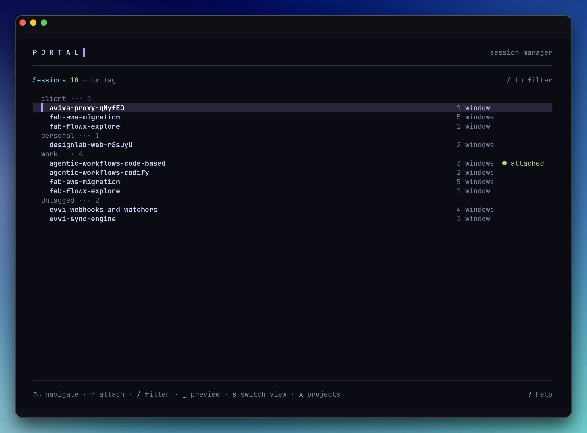
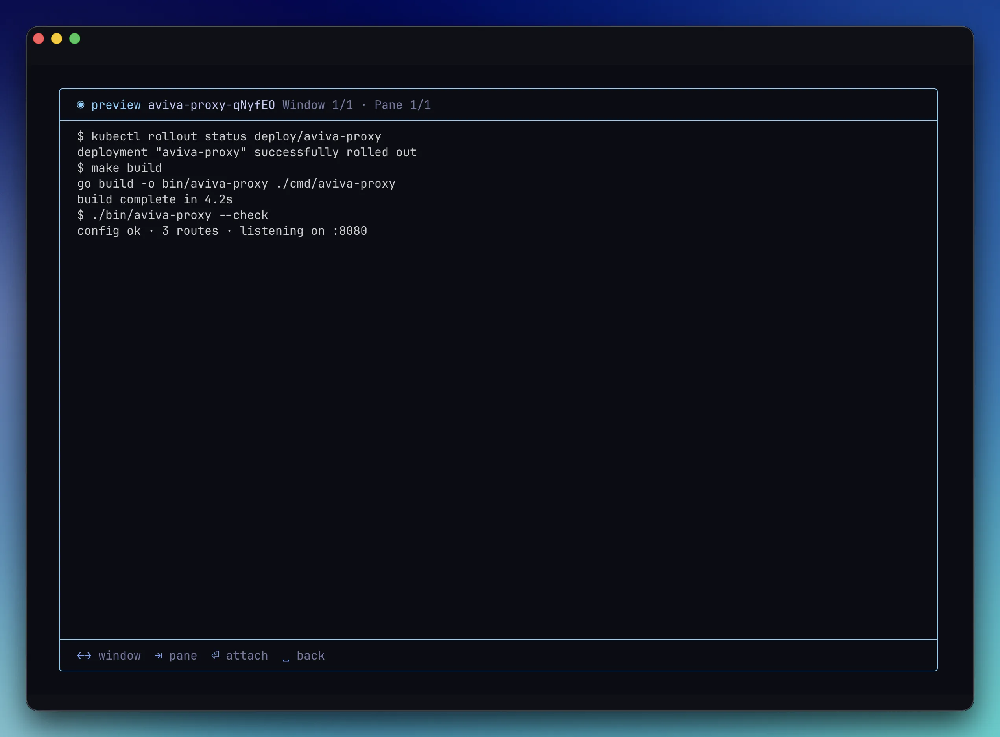
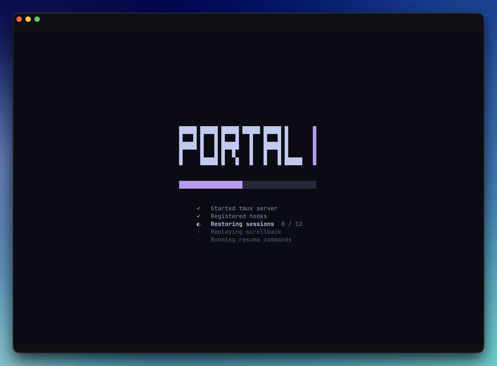
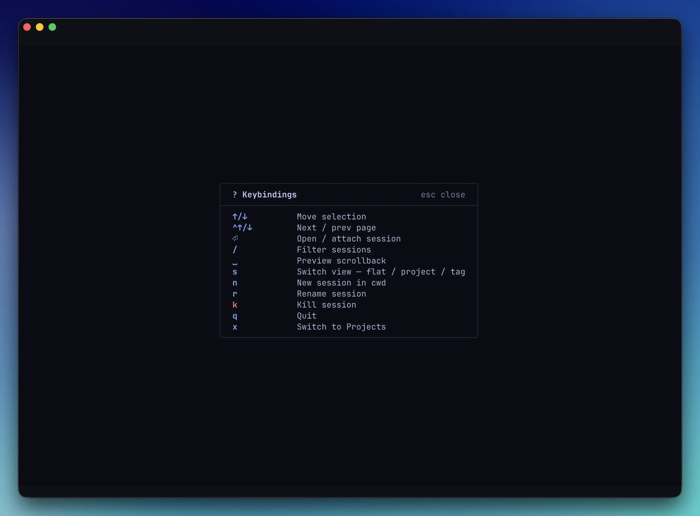
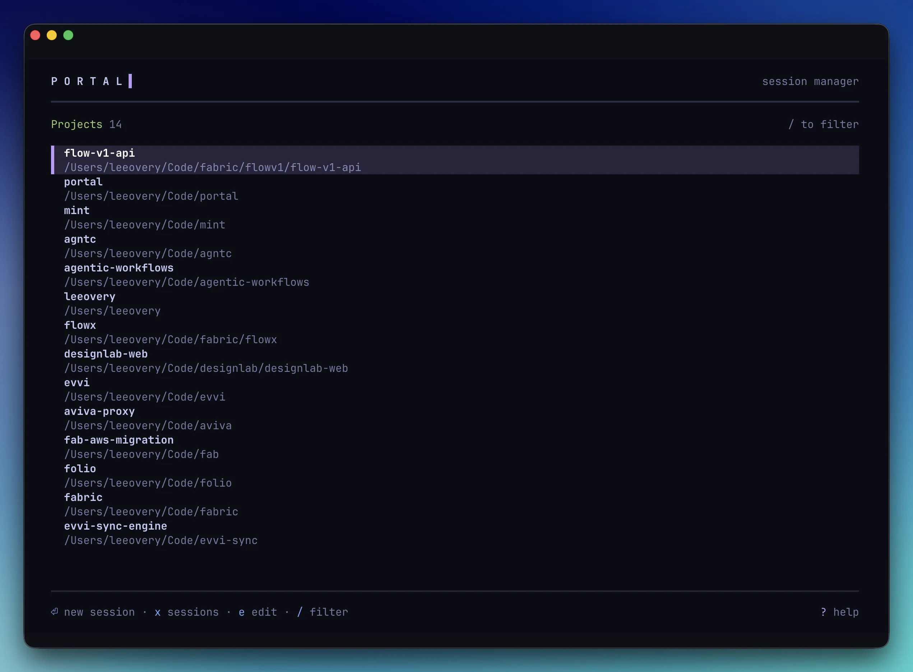
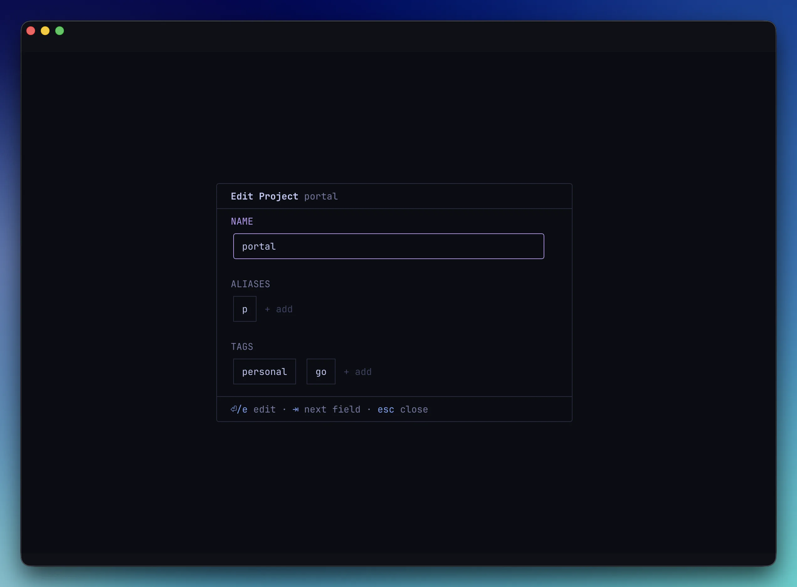
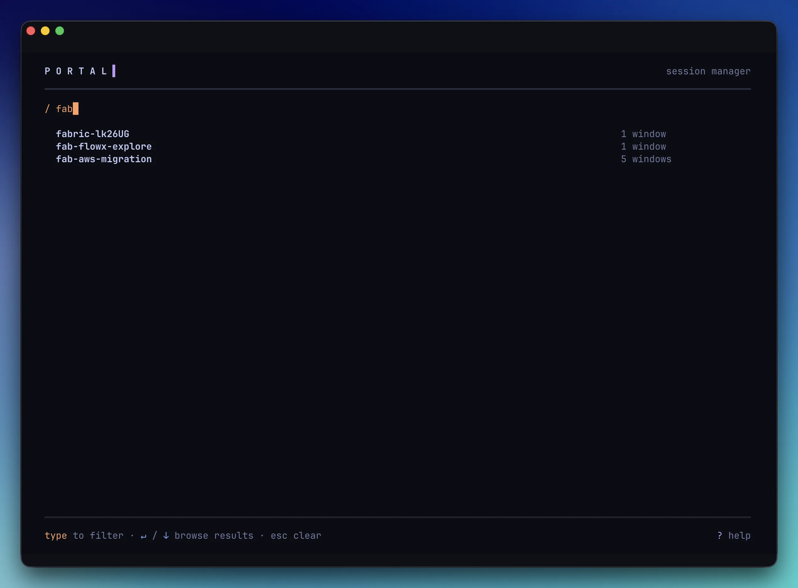
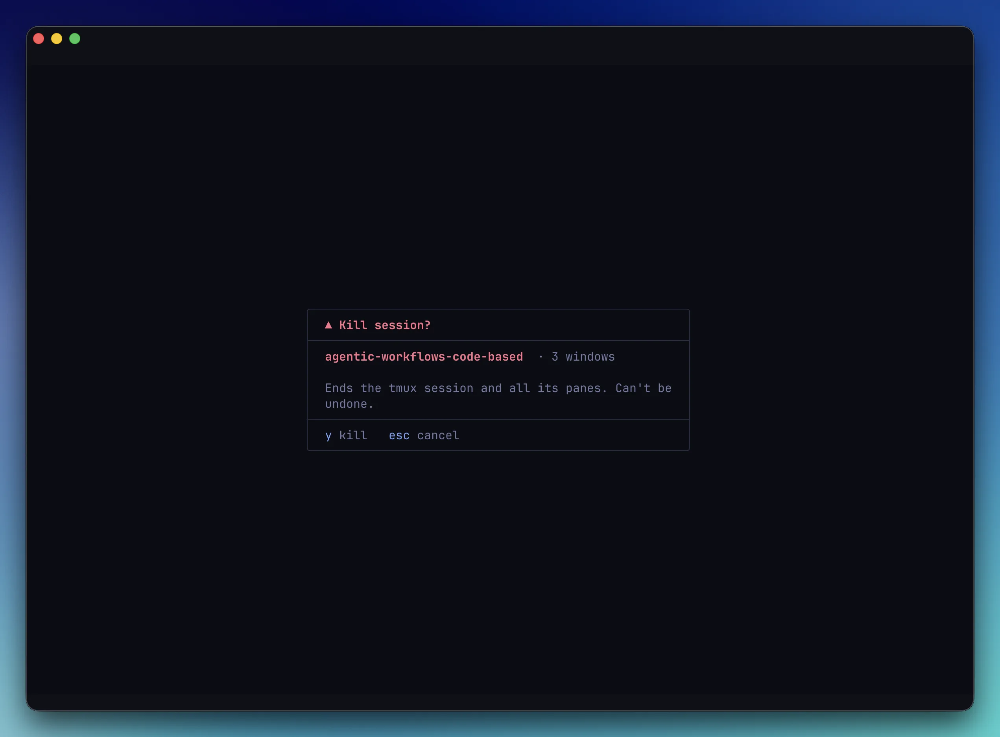

<div align="center">

# Portal

**Interactive session picker for tmux**

Fast, fuzzy session management from a bare shell, with project memory,
<br>path aliases, reboot-safe restoration, and a keyboard-driven TUI.

[](LICENSE)
[](https://go.dev)

[Getting Started](#getting-started) · [Install](#install) · [Commands](#commands) · [Shell Integration](#shell-integration) · [Configuration](#configuration)

<br>


</div>

---

Portal runs at a bare shell, before you enter tmux, and gives you an interactive TUI for picking, creating, and managing sessions. It remembers your projects, resolves paths via aliases and zoxide, auto-detects git roots, and restarts the tmux server and restores your saved sessions after a reboot.

After [shell setup](#shell-integration) you drive it through two functions: **`x`** (the picker and opener) and **`xctl`** (subcommands like `list`, `kill`, `alias`). Both names are configurable with `--cmd`.

## Getting Started

```bash
eval "$(portal init zsh)"          # add to ~/.zshrc: defines the x() and xctl() functions
x                                  # launch the interactive picker
x ~/Code/myproject                 # mint a new session at a path
x ~/Code/api -e "make dev"         # mint a new session and run a command
xctl alias set work ~/Code/work    # alias a path...
x work                             # ...then open it by name
xctl list                          # list running sessions
```

## Install

### Requirements

- **tmux ≥ 3.0** (released Feb 2020). Older versions are refused with a clear upgrade message.
- **Go** (to build from source), **macOS or Linux**.

**macOS**

```bash
brew install leeovery/tools/portal
```

**Linux**

```bash
curl -fsSL https://raw.githubusercontent.com/leeovery/portal/main/scripts/install.sh | bash
```

**Go**

```bash
go install github.com/leeovery/portal@latest
```

## Screenshots

<div align="center">

</div>

The full tour: grouping, fuzzy filter, scrollback preview, attach. Stills below.

|  |  |
|:---:|:---:|
| <br>**Grouped by tag** | <br>**Peek-mode scrollback preview** |
| <br>**Concurrent cold-boot loading** | <br>**Per-page `?` keymap** |
| <br>**Projects** | <br>**Edit project: name, aliases, tags** |
| <br>**Live fuzzy filter** | <br>**Destructive confirm** |

The same screens render in light mode and under `NO_COLOR` (see [Configuration](#configuration)).

## Features

- **Modern Vivid TUI**: a colourful, keyboard-driven picker that owns its own light or dark canvas (auto-detected, or pinned via `appearance`, and honours `NO_COLOR`), with an in-app `?` keymap on every page.
- **Session grouping and tags**: flip the list between flat, by project, and by tag with one key. Tags live on directories, so every session opened there inherits them.
- **Scrollback preview**: hit `Space` for a read-only peek at any session's saved scrollback, cycling windows and panes without attaching.
- **Reboot-safe sessions**: starts the tmux server and restores structure, layout, working dirs, and ANSI scrollback after a reboot, optionally re-running per-pane commands via resume hooks. Replaces tmux-resurrect / tmux-continuum.
- **Multi-window open**: name several targets (`x work api db`) or mark them with `m` in the picker and press `Enter` to open each in its own host-terminal window — rebuild your post-reboot window layout in one action instead of by hand. Ghostty works out of the box; other terminals via a `terminals.json` recipe.
- **Fast open**: jump to a project by path, alias, or zoxide (`x work`), or attach an existing session by name or glob (`x api`, `x 'api-*'`), with git-root resolution and project memory built in.

## Shell Integration

Portal generates shell functions via `portal init`. Add to your shell profile:

```bash
# zsh
eval "$(portal init zsh)"

# bash
eval "$(portal init bash)"

# fish
portal init fish | source
```

This creates two functions:

- **`x()`**: launches Portal (interactive picker or path-based session creation)
- **`xctl()`**: direct access to Portal subcommands (`list`, `kill`, `alias`, etc.)

Customize the function name with `--cmd`:

```bash
eval "$(portal init zsh --cmd p)"   # creates p() and pctl()
```

## Commands

> Examples below use the default `x` / `xctl` function names. If you used `--cmd p`, substitute `p` and `pctl`. You can also call the `portal` binary directly.

### `x` (open)

The single session verb — the picker, opening a target, and multi-window bursts all live here. `x` maps to `portal open`. (`x` absorbs the former `attach` and `spawn` commands; both are retired.)

```bash
x                                    # interactive TUI picker
x api                                # attach the existing session named "api"
x 'api-*'                            # attach every session matching the glob
x ~/Code/myproject                   # mint a new session at a path
x myalias                            # resolve alias → mint a new session there
x ~/Code/app -e "make dev"           # mint a session and run a command
x ~/Code/app -- npm start            # alternative command syntax
x work api ~/Code/new                # open three surfaces at once (see below)
```

**Resolution.** A bare target runs the precedence chain, first match wins:

**exact session name → path → alias → zoxide query.**

An exact session name **attaches** that existing session; a path, alias, or zoxide match **mints a brand-new session** there (directory targets always create — there is no find-or-create, so `x api` mints even while an `api-*` session runs; reach the existing one with the name, a glob, or `-s`). A target that resolves to nothing is a hard failure — there is no TUI-fallback-on-miss; the error points you at `-f`.

**Domain pins** skip the chain and force one domain (each hard-fails on a miss, never pops the picker):

| Flag | Pins to | Behaviour |
|---|---|---|
| `-s, --session <name/glob>` | session | attach; never mints |
| `-p, --path <dir>` | path | mint at the directory (must exist) |
| `-a, --alias <key/glob>` | alias | mint at the aliased directory |
| `-z, --zoxide <query>` | zoxide | mint at zoxide's best match (errors if zoxide isn't installed) |
| `-f, --filter <text>` | — | skip resolution, open the picker pre-filtered (mutually exclusive with any target or pin) |
| `-e, --exec <cmd>` / `-- <cmd>` | — | command to run in a **freshly minted** session (never an attach target) |

**Multi-window bursts.** Two or more targets (or one glob expanding to several sessions) open a portal to each: this terminal becomes the first surface and the remaining **N−1** open in host-terminal windows — **N windows for N targets**. Pins and bare targets mix freely (`x -s api -p ~/Code/new blog`), the command rides only the minted surfaces, and a supported terminal is required for the extra windows (Ghostty natively, others via [`terminals.json`](#configuration)). This is the command-line form of the picker's [multi-select mode](#multi-select-mode).

New sessions auto-resolve to the git repository root when applicable.

### `xctl list`

List running tmux sessions.

```bash
xctl list                            # auto-detect format
xctl list --long                     # full details
xctl list --short                    # names only
```

| Flag | Description |
|---|---|
| `--long` | Full session details (name, status, window count) |
| `--short` | Session names only, one per line |

### `xctl kill`

Kill a tmux session by name.

```bash
xctl kill myproject
```

### `xctl alias`

Manage path aliases for quick session access.

```bash
xctl alias set work ~/Code/work      # create alias
xctl alias rm work                   # remove alias
xctl alias list                      # list all aliases
```

### `xctl hook`

Register per-pane commands that re-execute automatically when a session is attached after a reboot. `hook set` must be run from inside a tmux pane; `hook rm` defaults to the current pane but accepts `--pane-key` to remove a hook for any pane (including ones that no longer exist).

The verb is **`hook`** (singular); **`hooks`** is kept as a permanent silent alias, so existing `xctl hooks …` scripts keep working unchanged.

Hooks stay attached to a session even if you rename it, whether from the picker's `r` modal or an external `tmux rename-session`. A renamed session still re-runs its command after the next reboot.

```bash
xctl hook set --on-resume "npm start"            # register a resume hook
xctl hook rm --on-resume                         # remove the current pane's hook
xctl hook rm --on-resume --pane-key 'sess:0.1'   # remove a specific entry (works outside tmux)
xctl hook list                                   # list all hooks
```

**When hooks fire:** resume hooks run only when Portal recreates a pane from saved state
after a reboot, once the tmux server has started fresh. They do not run on an ordinary
detach and reattach within the same server lifetime, because the pane and its process
are still alive; re-running the hook then would launch a second copy of a long-running
command such as a dev server.

### `xctl doctor`

A read-only health report across Portal's resurrection machinery — daemon alive, global hooks registered without duplicates, `_portal-saver` up, state dir sane, `sessions.json` valid, no stale entries, and the detected host terminal. It starts nothing (a down runtime is reported honestly, not silently started), and exits `0` only when every check passes, non-zero otherwise — a scriptable health gate. The host-terminal line is informational and never affects the exit code.

```bash
xctl doctor              # health report (subsumes the retired `state status`)
xctl doctor --fix        # apply low-stakes repairs, then re-diagnose
```

`--fix` performs the reversible-by-reconstruction repairs: prune stale hooks, prune stale projects (replacing the retired `clean`), and sweep old logs. It re-runs the diagnosis afterwards and the exit code reflects the post-repair state. The daemon already runs these prunes automatically on a slow cadence, so `doctor` usually reads healthy without you doing anything — `--fix` is the manual trigger. The host-terminal check (folding in the retired `spawn --detect`) prints the detected terminal and its bundle id so you can copy it into [`terminals.json`](#configuration).

### `portal uninstall`

Remove Portal's tmux-server footprint — kill the save daemon and unregister the global hooks — **without touching any files**. Saved sessions and all config are left in place; the next `x`/`portal open` re-bootstraps the runtime, so it means "deactivate Portal's machinery now," not "destroy my data." Idempotent: a no-op on already-clean state. See [Uninstall](#uninstall).

```bash
portal uninstall
```

### `xctl version`

Print the Portal version.

```bash
xctl version
```

### `portal init`

Output shell integration script for eval. See [Shell Integration](#shell-integration). This is the one command you call via the `portal` binary directly.

```bash
portal init zsh
portal init bash --cmd p
```

## TUI Keybindings

Navigation is **arrows only** (no vim or page-jump aliases). Press **`?`** on any page for an in-app help modal listing that page's complete keymap.

| Key | Action |
|---|---|
| `↑` / `↓` | Move up / down |
| `Ctrl+↑` / `Ctrl+↓` | Page up / down |
| `Enter` | Attach to / open the highlighted session |
| `Space` | Preview scrollback of highlighted session (sessions list only) |
| `/` | Filter mode (fuzzy search) |
| `s` | Switch view: cycle Flat → By Project → By Tag (sessions list only) |
| `m` | Multi-select mode: enter marks the highlighted session, then toggle any row's mark (sessions list only) |
| `x` | Toggle between Sessions and Projects |
| `r` | Rename session |
| `k` | Kill session |
| `n` | New session in the current directory |
| `?` | Show the full keymap for the current page |
| `q` / `Esc` | Quit (`Esc` clears an active filter first) |

The TUI has three views: session list, project picker, and scrollback preview. It paints its own light/dark canvas (set `appearance` in `prefs.json`, or `NO_COLOR` for a colourless render; see [Configuration](#configuration)).

### Scrollback Preview

`Space` on the highlighted session opens a Quick Look-style preview of that
session's saved scrollback, so you can tell similarly-named sessions apart
without attaching. The preview is read-only: opening and closing it changes
nothing about the session.

| Key | Action |
|---|---|
| `←` / `→` | Previous / next window (wraps) |
| `Tab` | Next pane within the current window (wraps) |
| `↑` / `↓`, `Ctrl+↑` / `Ctrl+↓` | Scroll within the loaded buffer |
| `Enter` | Attach to this pane |
| `Space` / `Esc` | Return to the sessions list |

Each pane shows the last ~1000 lines of saved scrollback. The frame shows the session
name, the current `Window x/y · Pane x/y`, and a footer of key hints, styled in a cyan
"peek mode" so a preview never looks like a live session. A pane with no saved content
yet renders `(no saved content)`.

### Multi-Select Mode

Press **`m`** on the sessions list to enter multi-select mode, which marks the
currently-highlighted session as your first selection. Press `m` again on any row to mark or
unmark it — you can also sit in the mode with nothing selected (toggle the auto-marked row off,
or enter while the cursor is on a group header). Press **`Enter`**
to open every marked session at once — each springs open attached in its own host-terminal
window. The result is **N windows for N sessions**: the picker reuses its own window for one
of them and spawns the rest as fresh host windows, so there is never a leftover empty picker
window. `Esc` cancels and clears the selection.

| Key | Action |
|---|---|
| `m` | Enter mode marking the highlighted session / toggle a row's mark |
| `↑` / `↓` | Move between sessions (marks persist) |
| `Space` | Preview the highlighted session's scrollback |
| `/` | Filter (marks persist underneath) |
| `Enter` | Open every marked session (one marked → a plain attach in place) |
| `Esc` | Cancel and clear the selection |

Marks are sticky across filtering, paging, regrouping, and the `Space`-preview round-trip;
a session killed elsewhere while you were in the mode drops out of the selection.

Spawning host windows needs a supported terminal. **Ghostty** works out of the box; other
terminals are configured via [`terminals.json`](#configuration). On an unsupported terminal
(or a remote/mosh client with no local window) Portal shows a banner naming the detected
terminal and its bundle id, and opening two or more marked sessions is a no-op — a single
marked session still attaches in the current window, which needs no host-window support. Run
`xctl doctor` to see what Portal detects. If a burst only partially succeeds, Portal
leaves the windows that did open in place and keeps the failed sessions marked, so pressing
`Enter` again retries just those.

## Session Grouping & Tags

By default the session list is flat and alphabetical. Press **`s`** on the sessions
list to cycle the view through three modes:

- **Flat**: a single alphabetical list.
- **By Project**: a heading per directory, with each session listed once under its
  project name. Useful with no setup at all.
- **By Tag**: a heading per tag, with a session appearing under *each* tag its
  directory carries. Untagged sessions collect under a pinned **Untagged** group.

Portal remembers the last-used mode across launches in `prefs.json`. Group headers are
dimmed, non-selectable, and show a count, and the cursor only ever lands on sessions.
While the `/` filter is active the list flattens to matching sessions and the headers
step aside, returning when the filter clears.

**Tags live on directories (projects), not individual sessions.** Every session opened
in a directory inherits that directory's tags, so there is nothing to tag per session.
Tags are freeform and trimmed, but **case-sensitive**: `Work` and `work` are different
tags, and each is stored exactly as typed. Applying a tag to a second directory adds it
to that group, and removing a tag's last use makes the group disappear.

**Managing tags:** open the projects picker (press `x`, then `x` again to switch from
sessions to projects), highlight a project, and edit it. The edit modal has **Name**,
**Aliases**, and **Tags** fields. `Tab` (or `↑`/`↓`) moves between fields, and `←`/`→`
moves between chips and the trailing `+ add` slot. To add a tag, land on `+ add`, press
`Enter` (or `+`), type the tag, and press `Enter` to save; press `x` on a chip to remove
it. Every edit saves immediately, with no separate confirm step, and `Esc` never
discards saved work: it just backs out the current edit or closes the modal. Only
directories already opened in Portal are taggable, so open a directory once before
tagging it.

## Automatic Server Bootstrap & Restoration

Whenever you run a command that needs tmux, Portal checks that the server is running and
starts it if it is not. In the same step it re-creates any saved sessions that are not
already live, so after a reboot your sessions come back with their structure, layout,
zoom, and working directories intact. Scrollback (including ANSI colour) loads as you
attach, and resume hooks run on the recreated panes.

This replaces tmux-continuum and tmux-resurrect for session persistence. If you have
either installed, remove it (or set `@continuum-restore off`) to avoid restoring twice.

Pair restoration with [resume hooks](#xctl-hook) to re-run pane commands such as dev
servers and editors after a reboot.

## Configuration

Portal resolves its config directory using XDG: `$XDG_CONFIG_HOME/portal/` if set, otherwise `~/.config/portal/`. Each file also has a per-file env var override that takes full precedence.

| File | Purpose | Env override |
|---|---|---|
| `aliases` | Path aliases (key=value, one per line) | `PORTAL_ALIASES_FILE` |
| `projects.json` | Remembered project directories | `PORTAL_PROJECTS_FILE` |
| `hooks.json` | Per-pane resume hooks (pane → event → command) | `PORTAL_HOOKS_FILE` |
| `prefs.json` | UI preferences: last-used session-list grouping mode and the owned-canvas `appearance` (`auto`/`light`/`dark`) | `PORTAL_PREFS_FILE` |
| `terminals.json` | Host-terminal window recipes for [multi-select](#multi-select-mode) / multi-target `x` on custom terminals (Ghostty is built in). User-authored, read-only. | `PORTAL_TERMINALS_FILE` |
| `state/` | Saved session structure + scrollback for automatic restoration on reboot. Contains: `sessions.json` (structure index), `scrollback/*.bin` (per-pane content), `daemon.pid` + `daemon.version` (liveness markers), `portal.log` (structured, rotating diagnostics; see [Logging](#logging)). See [Privacy Considerations](#privacy-considerations). | `PORTAL_STATE_DIR` |

Projects are auto-populated when you create new sessions, pruned automatically by the daemon, and cleanable on demand with `xctl doctor --fix`.

**Appearance.** Portal paints its own light or dark canvas so its colours always sit on the surface they were tuned for. By default (`"appearance": "auto"`) it detects your terminal's background and matches it, falling back to dark if the terminal doesn't answer. Set `"appearance": "light"` or `"dark"` in `prefs.json` to pin the canvas and skip detection, which helps when auto-detection misfires (for example under tmux passthrough). Setting `NO_COLOR` to any non-empty value disables the canvas and renders on your terminal's native colours.

**Custom terminals (`terminals.json`).** Portal opens host windows natively on Ghostty. For any other terminal, add a recipe keyed by the identity Portal shows you (run `xctl doctor`, or read the unsupported banner — a friendly `.app` name, a raw bundle id, or a `*`-glob). Each recipe describes how that terminal opens a window running a command, with `{command}` as the placeholder Portal fills in:

```json
// ~/.config/portal/terminals.json
{
  "dev.warp.Warp-*": {
    "commands": { "open": { "argv": ["osascript", "-e", "tell app \"Warp\" to create window with command \"{command}\""] } }
  },
  "com.example.MyTerm": {
    "commands": { "open": { "script": "~/.config/portal/terminals/myterm.sh" } }
  }
}
```

A recipe is either an `argv` array (Portal substitutes `{command}` into one element) **or** a `script` path (Portal runs the file with the command as `$1`) — exactly one of the two. The file is tolerant: a malformed or invalid entry is skipped with a `spawn:` log breadcrumb and Portal falls back to the native adapter. `{command}` already carries its own PATH/environment, so recipes never need env plumbing.

## Logging

Portal writes a structured diagnostic log to `state/portal.log` (under `PORTAL_STATE_DIR`). It is human-readable text with a `subsystem:` prefix on every line, so `grep "daemon:" portal.log` (or `restore:`, `saver:`, `hydrate:`, `spawn:`, `resolve:`, …) reconstructs what any subsystem did. `portal.log` is a symlink to a calendar-daily file (`portal.log.<date>`), so `tail -f portal.log` always follows today's log.

- **Rotation:** a new file each local day; older files are kept read-only. A size-cap safety valve rolls over to `portal.log.<date>.N` if a single day ever grows huge.
- **Retention:** rotated files older than 30 days are deleted automatically (one breadcrumb logged per deletion). `xctl doctor --fix` forces a sweep on demand.
- **Level:** defaults to `info` (a few lines per meaningful event). Set `PORTAL_LOG_LEVEL=debug` to capture full reconstruction detail when investigating an issue.

| Env var | Purpose | Default |
|---|---|---|
| `PORTAL_LOG_LEVEL` | Verbosity: `debug` / `info` / `warn` / `error` | `info` |
| `PORTAL_LOG_ROTATE_SIZE` | Per-day size cap before overflow (`K`/`M`/`G` suffix, e.g. `500M`, `1G`) | `500M` |
| `PORTAL_LOG_RETENTION_DAYS` | Days of rotated logs to keep | `30` |

## Privacy Considerations

Portal persists pane scrollback to `~/.config/portal/state/` (override via
`PORTAL_STATE_DIR`) so it can rehydrate sessions after a reboot. Files are written
mode `0600`, directories `0700`.

- Same local-filesystem trust model as your shell history: anything visible in
  your terminal can end up in the saved state.
- **No encryption at rest.** If a pane displays secrets (tokens, credentials,
  diffs of sensitive files), they will be captured.
- **`portal.log` records config changes verbatim.** It does not contain pane
  scrollback, but config-mutation breadcrumbs and exec handoffs are logged as-is:
  a `xctl hook set --on-resume "<cmd>"` command string, alias values, and
  project paths appear in the log. Redact manually if you share it in a bug report.
- **Mitigations:** for sensitive panes, run `tmux set-option -w history-limit 0`
  to prevent scrollback from accumulating, or `tmux clear-history` on demand
  (run before the next save, which lands at most ~30s later).
- v1 has no per-session opt-out; the tmux-native workarounds above are the
  supported path.

## Uninstall

Two paths depending on whether you want to keep your saved state:

- **Just remove the binary:** `brew uninstall portal` or `rm $(which portal)`.
  Portal's tmux hooks check for the binary before they run, so tmux keeps working
  normally once it is gone. Your saved state is preserved, and reinstalling picks
  up where it left off.
- **Explicit teardown:** run `portal uninstall` (kills the daemon and unregisters
  Portal's global tmux hooks). It touches **no files** — saved sessions and all
  config are left in place, and running `x` again re-bootstraps the runtime. To
  remove Portal completely, uninstall the binary and delete `~/.config/portal/`
  (which holds both state and config) yourself.

## License

MIT
