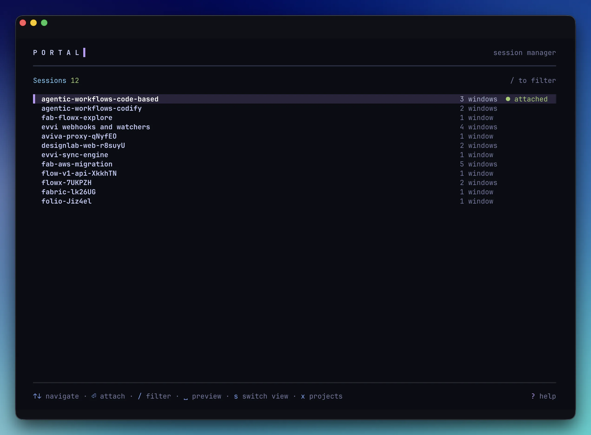

<div align="center">

# Portal

**Interactive session picker for tmux**

Fast, fuzzy session management from a bare shell, with project memory,
<br>path aliases, reboot-safe restoration, and a keyboard-driven TUI.

[](LICENSE)
[](https://go.dev)

[Getting Started](#getting-started) · [Install](#install) · [Commands](#commands) · [Shell Integration](#shell-integration) · [Configuration](#configuration)

<br>



</div>

---

Portal runs at a bare shell, before you enter tmux, and gives you an interactive TUI for picking, creating, and managing sessions. It remembers your projects, resolves paths via aliases and zoxide, auto-detects git roots, and restarts the tmux server and restores your saved sessions after a reboot.

After [shell setup](#shell-integration) you drive it through two functions: **`x`** (the picker and opener) and **`xctl`** (subcommands like `list`, `kill`, `alias`). Both names are configurable with `--cmd`.

## Getting Started

```bash
eval "$(portal init zsh)"          # add to ~/.zshrc: defines the x() and xctl() functions
x                                  # launch the interactive picker
x ~/Code/myproject                 # open a session at a path (creates it, or attaches)
x ~/Code/api -e "make dev"         # open a session and run a command
xctl alias set work ~/Code/work    # alias a path...
x work                             # ...then open it by name
xctl list                          # list running sessions
```

## Install

### Requirements

- **tmux ≥ 3.0** (released Feb 2020). Portal uses array-indexed global hooks
  (`set-hook -ga`) which require 3.0+. Earlier versions exit with
  `Portal requires tmux ≥ 3.0 (found <version>). Please upgrade.`
- **Go** (to build from source), **macOS or Linux**.

**macOS**

```bash
brew install leeovery/tools/portal
```

**Linux**

```bash
curl -fsSL https://raw.githubusercontent.com/leeovery/portal/main/scripts/install.sh | bash
```

**Go**

```bash
go install github.com/leeovery/portal@latest
```

## Screenshots

|  |  |
|:---:|:---:|
| <br>**Grouped by tag** | <br>**Peek-mode scrollback preview** |
| <br>**Concurrent cold-boot loading** | <br>**Per-page `?` keymap** |
| <br>**Projects** | <br>**Edit project: name, aliases, tags** |
| <br>**Live fuzzy filter** | <br>**Destructive confirm** |

Light mode and the `NO_COLOR` path render from the same token layer (see [Configuration](#configuration)).

## Features

- **Modern Vivid TUI**: a colourful, keyboard-driven picker that owns its own light/dark canvas (auto-detected via OSC 11, or pinned via `appearance`; honours `NO_COLOR`), with an in-app `?` keymap on every page.
- **Session grouping and tags**: flip the list between flat, by project, and by tag with one key. Tags live on directories, so every session opened there inherits them.
- **Scrollback preview**: hit `Space` for a read-only peek at any session's saved scrollback, cycling windows and panes without attaching.
- **Reboot-safe sessions**: starts the tmux server and restores structure, layout, working dirs, and ANSI scrollback after a reboot, optionally re-running per-pane commands via resume hooks. Replaces tmux-resurrect / tmux-continuum.
- **Fast open**: jump to a project by path, alias, or zoxide (`x work`), with git-root resolution and project memory built in.

## Shell Integration

Portal generates shell functions via `portal init`. Add to your shell profile:

```bash
# zsh
eval "$(portal init zsh)"

# bash
eval "$(portal init bash)"

# fish
portal init fish | source
```

This creates two functions:

- **`x()`**: launches Portal (interactive picker or path-based session creation)
- **`xctl()`**: direct access to Portal subcommands (`list`, `kill`, `alias`, etc.)

Customize the function name with `--cmd`:

```bash
eval "$(portal init zsh --cmd p)"   # creates p() and pctl()
```

## Commands

> Examples below use the default `x` / `xctl` function names. If you used `--cmd p`, substitute `p` and `pctl`. You can also call the `portal` binary directly.

### `x` (open)

Interactive session picker or path-based session creation. `x` maps to `portal open`.

```bash
x                                    # interactive TUI
x ~/Code/myproject                   # open session at path
x myalias                            # resolve alias → path → session
x ~/Code/app -e "make dev"           # run command in new session
x ~/Code/app -- npm start            # alternative command syntax
```

| Flag | Description |
|---|---|
| `-e, --exec` | Command to execute in the new session |

Path resolution order: aliases → zoxide → TUI with filter.

New sessions auto-resolve to the git repository root when applicable.

### `xctl attach`

Attach to an existing tmux session by name.

```bash
xctl attach myproject
```

### `xctl list`

List running tmux sessions.

```bash
xctl list                            # auto-detect format
xctl list --long                     # full details
xctl list --short                    # names only
```

| Flag | Description |
|---|---|
| `--long` | Full session details (name, status, window count) |
| `--short` | Session names only, one per line |

### `xctl kill`

Kill a tmux session by name.

```bash
xctl kill myproject
```

### `xctl alias`

Manage path aliases for quick session access.

```bash
xctl alias set work ~/Code/work      # create alias
xctl alias rm work                   # remove alias
xctl alias list                      # list all aliases
```

### `xctl hooks`

Register per-pane commands that re-execute automatically when a session is attached after a reboot. `hooks set` must be run from inside a tmux pane; `hooks rm` defaults to the current pane but accepts `--pane-key` to remove a hook for any pane (including ones that no longer exist).

```bash
xctl hooks set --on-resume "npm start"            # register a resume hook
xctl hooks rm --on-resume                         # remove the current pane's hook
xctl hooks rm --on-resume --pane-key 'sess:0.1'   # remove a specific entry (works outside tmux)
xctl hooks list                                   # list all hooks
```

**When hooks fire:** Portal fires resume hooks ONLY when a pane is freshly recreated
from saved state on reboot recovery: the tmux server has just been started fresh and
Portal has restored sessions. Hooks do NOT fire on every detach / reattach within a
single server lifetime. If a pane still exists, its hook process either already ran or
was explicitly killed; firing again would double-launch long-running processes like
`claude --resume`. This is deliberate.

### `xctl clean`

Remove stale projects whose directories no longer exist on disk, and prune hooks for panes that no longer exist.

```bash
xctl clean              # prune stale projects + hooks (rotated logs preserved)
xctl clean --logs       # also delete rotated portal.log.<date> files, keeping today's
```

`xctl clean` preserves rotated logs by default; pass `--logs` to additionally sweep every rotated `portal.log.<date>` file (see [Logging](#logging)).

### `xctl state`

Inspect or tear down Portal's saved-session state used for reboot restoration.

```bash
xctl state status                    # daemon + state health
xctl state cleanup                   # remove hooks + stop daemon
xctl state cleanup --purge           # also wipe ~/.config/portal/state/
```

- `xctl state status`: print daemon status, last save time, captured counts,
  state size, and recent warnings. Exits non-zero when the daemon is down, last
  save is stale, or warnings are present in the last hour.
- `xctl state cleanup [--purge]`: kills the daemon and removes Portal's tmux
  hook entries. With `--purge`, also removes `~/.config/portal/state/`.

### `xctl version`

Print the Portal version.

```bash
xctl version
```

### `portal init`

Output shell integration script for eval. See [Shell Integration](#shell-integration). This is the one command you call via the `portal` binary directly.

```bash
portal init zsh
portal init bash --cmd p
```

## TUI Keybindings

Navigation is **arrows only**: there are no vim (`j`/`k`/`g`/`G`) or page-jump (`PgUp`/`Home`/…) aliases, and no uppercase bindings. Press **`?`** on any page for an in-app help modal listing that page's complete keymap.

| Key | Action |
|---|---|
| `↑` / `↓` | Move up / down |
| `Ctrl+↑` / `Ctrl+↓` | Page up / down |
| `Enter` | Attach to / open the highlighted session |
| `Space` | Preview scrollback of highlighted session (sessions list only) |
| `/` | Filter mode (fuzzy search) |
| `s` | Switch view: cycle Flat → By Project → By Tag (sessions list only) |
| `x` | Toggle between Sessions and Projects |
| `r` | Rename session |
| `k` | Kill session |
| `n` | New session in the current directory |
| `?` | Show the full keymap for the current page |
| `q` / `Esc` | Quit (`Esc` clears an active filter first) |

The TUI has three views: session list, project picker, and scrollback preview. It paints its own light/dark canvas (set `appearance` in `prefs.json`, or `NO_COLOR` for a colourless render; see [Configuration](#configuration)).

### Scrollback Preview

`Space` on the highlighted session opens a Quick Look-style preview of that
session's saved scrollback so you can disambiguate similarly-named sessions
without paying the attach/detach cost. The preview is read-only: opening and
dismissing it leaves the session byte-identical (no hydration, no resume-hook
firing, no tmux state mutation).

| Key | Action |
|---|---|
| `←` / `→` | Previous / next window (wraps) |
| `Tab` | Next pane within the current window (wraps) |
| `↑` / `↓`, `Ctrl+↑` / `Ctrl+↓` | Scroll within the loaded buffer |
| `Enter` | Attach to this pane |
| `Space` / `Esc` | Return to the sessions list |

Each pane shows the last ~1000 lines of saved scrollback, anchored at the
tail. Chrome shows the session name with `Window x/y · Pane x/y` and a footer
of key hints, in a distinct cyan "peek mode" frame so a preview never looks
like a live session. A pane that has no saved content yet (brand-new session,
daemon hasn't ticked) renders `(no saved content)`.

## Session Grouping & Tags

By default the session list is flat and alphabetical. Press **`s`** on the sessions
list to cycle the view through three modes:

- **Flat**: today's list, unchanged.
- **By Project**: a heading per directory; each session appears once under its
  project name. Valuable with zero setup.
- **By Tag**: a heading per tag; a session appears under *each* tag its directory
  carries. Untagged sessions collect under a pinned **Untagged** group.

The cycle is unconditional (it always includes By Tag, even with no tags or no
sessions) and the last-used mode is remembered across launches in `prefs.json`.
Group headers are dimmed, non-selectable, and show a count; the cursor only ever
lands on sessions. While the `/` filter is active the list flattens to matching
sessions and the headers step aside, restoring when the filter clears.

**Tags live on directories (projects), not individual sessions.** Every session
opened in a directory inherits that directory's tags via a live lookup, so there is
nothing to tag per session. Tags are freeform and trimmed, but **case-sensitive**
(`Work` and `work` are different tags; the text is stored exactly as typed);
applying a tag to a second directory auto-joins that group, and removing the last
use of a tag makes the group disappear. There is no tag registry and no `tags`
CLI in v1.

**Managing tags:** open the projects picker (`x`, then switch to projects with
`x`), highlight a project, and edit it. The edit modal has **Name**, **Aliases**,
and **Tags** fields. `Tab` (or `↑`/`↓`) moves between them and `←`/`→` between
chips and the trailing `+ add` slot. To add a tag, land on `+ add` and press
`Enter` (or `+`), type it, and `Enter` to save; press `x` on a chip to remove it.
Every edit **saves immediately**: there is no separate confirm step, and `Esc`
never discards saved work (it just backs out the current edit or closes the
modal). Only directories already opened in Portal (i.e. known projects) are
taggable, so open a directory once, then tag it.

## Automatic Server Bootstrap & Restoration

Portal automatically starts the tmux server if absent AND restores saved sessions
in the same bootstrap step. After a reboot, your sessions return with structure,
layout, zoom, working directories, and scrollback (including ANSI colour). On any
tmux-needing command, Portal checks the server, starts it if missing, and re-creates
saved sessions that aren't already live. Scrollback injects lazily when you attach.
Resume hooks fire on freshly-recreated panes. The TUI shows a "Restoring sessions…"
loading screen for at most ~1.2s; the CLI is silent.

Replaces tmux-continuum / tmux-resurrect for session persistence. Uninstall those
plugins if you have them (or set `@continuum-restore off` for tmux-resurrect/continuum)
to avoid duplicate restoration.

Pair this with [resume hooks](#xctl-hooks) to automatically re-run pane commands
(dev servers, editors, etc.) after a reboot.

## Configuration

Portal resolves its config directory using XDG: `$XDG_CONFIG_HOME/portal/` if set, otherwise `~/.config/portal/`. Each file also has a per-file env var override that takes full precedence.

| File | Purpose | Env override |
|---|---|---|
| `aliases` | Path aliases (key=value, one per line) | `PORTAL_ALIASES_FILE` |
| `projects.json` | Remembered project directories | `PORTAL_PROJECTS_FILE` |
| `hooks.json` | Per-pane resume hooks (pane → event → command) | `PORTAL_HOOKS_FILE` |
| `prefs.json` | UI preferences: last-used session-list grouping mode and the owned-canvas `appearance` (`auto`/`light`/`dark`) | `PORTAL_PREFS_FILE` |
| `state/` | Saved session structure + scrollback for automatic restoration on reboot. Contains: `sessions.json` (structure index), `scrollback/*.bin` (per-pane content), `daemon.pid` + `daemon.version` (liveness markers), `portal.log` (structured, rotating diagnostics; see [Logging](#logging)). See [Privacy Considerations](#privacy-considerations). | `PORTAL_STATE_DIR` |

Projects are auto-populated when you create new sessions and cleaned with `xctl clean`.

**Appearance.** Portal paints its own light or dark canvas so its colours always sit on the surface they were tuned for. By default (`"appearance": "auto"`) it detects your terminal's background via an OSC 11 query and matches it, falling back to dark if the terminal doesn't answer. Set `"appearance": "light"` or `"dark"` in `prefs.json` to pin the canvas and skip detection (useful when detection misfires, e.g. under tmux passthrough). Setting `NO_COLOR` (to any non-empty value) disables the canvas entirely and renders colourlessly on your terminal's native colours.

## Logging

Portal writes a structured diagnostic log to `state/portal.log` (under `PORTAL_STATE_DIR`). It is human-readable text with a `subsystem:` prefix on every line, so `grep "daemon:" portal.log` (or `restore:`, `saver:`, `hydrate:`, …) reconstructs what any subsystem did. `portal.log` is a symlink to a calendar-daily file (`portal.log.<date>`), so `tail -f portal.log` always follows today's log.

- **Rotation:** a new file each local day; older files are kept read-only. A size-cap safety valve rolls over to `portal.log.<date>.N` if a single day ever grows huge.
- **Retention:** rotated files older than 30 days are deleted automatically (one breadcrumb logged per deletion). `xctl clean --logs` sweeps them on demand.
- **Level:** defaults to `info` (a few lines per meaningful event). Set `PORTAL_LOG_LEVEL=debug` to capture full reconstruction detail when investigating an issue.

| Env var | Purpose | Default |
|---|---|---|
| `PORTAL_LOG_LEVEL` | Verbosity: `debug` / `info` / `warn` / `error` | `info` |
| `PORTAL_LOG_ROTATE_SIZE` | Per-day size cap before overflow (`K`/`M`/`G` suffix, e.g. `500M`, `1G`) | `500M` |
| `PORTAL_LOG_RETENTION_DAYS` | Days of rotated logs to keep | `30` |

## Privacy Considerations

Portal persists pane scrollback to `~/.config/portal/state/` (override via
`PORTAL_STATE_DIR`) so it can rehydrate sessions after a reboot. Files are written
mode `0600`, directories `0700`.

- Same local-filesystem trust model as your shell history: anything visible in
  your terminal can end up in the saved state.
- **No encryption at rest.** If a pane displays secrets (tokens, credentials,
  diffs of sensitive files), they will be captured.
- **`portal.log` records config changes verbatim.** It does not contain pane
  scrollback, but config-mutation breadcrumbs and exec handoffs are logged as-is:
  a `xctl hooks set --on-resume "<cmd>"` command string, alias values, and
  project paths appear in the log. Redact manually if you share it in a bug report.
- **Mitigations:** for sensitive panes, run `tmux set-option -w history-limit 0`
  to prevent scrollback from accumulating, or `tmux clear-history` on demand
  (run before the next save, which lands at most ~30s later).
- v1 has no per-session opt-out; the tmux-native workarounds above are the
  supported path.

## Uninstall

Two paths depending on whether you want to keep your saved state:

- **Just remove the binary:** `brew uninstall portal` or `rm $(which portal)`.
  The defensive `command -v portal` guard in the registered tmux hooks
  short-circuits when the binary is gone, so tmux keeps running normally. Your
  saved state is preserved; reinstalling Portal picks up where it left off.
- **Explicit teardown:** run `portal state cleanup` (kills the daemon and
  removes Portal's tmux hook entries), or `portal state cleanup --purge` to
  also wipe saved state under `~/.config/portal/state/`. Then uninstall the
  binary. Use `--purge` for a completely clean slate. Non-state config
  (`hooks.json`, `projects.json`, `aliases`) is preserved either way; remove
  manually if desired.

## License

MIT
